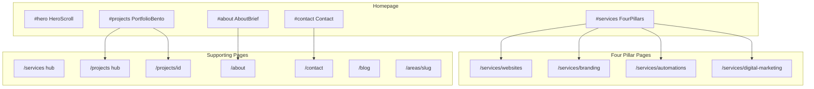
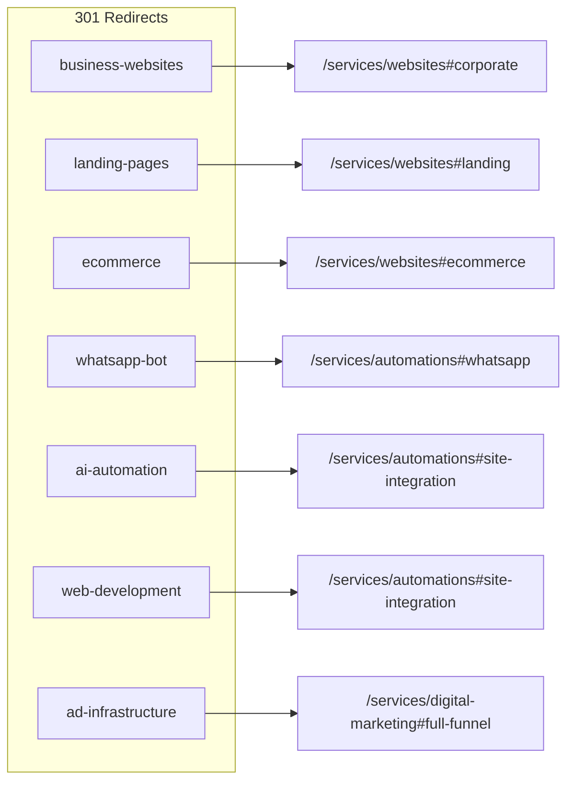

# JT Solutions — Site Revamp Blueprint

**Version:** 1.0  
**Date:** June 2026  
**Status:** Execution specification — no code in this document  
**Scope:** Full UI/UX revamp + homepage restructure + 4-pillar service architecture  

---

## Table of Contents

1. [Vision & Principles](#1-vision--principles)
2. [Current State Audit](#2-current-state-audit)
3. [Target Information Architecture](#3-target-information-architecture)
4. [Design System Specification](#4-design-system-specification)
5. [Homepage Specification (5 Sections)](#5-homepage-specification-5-sections)
6. [Four Pillar Service Architecture](#6-four-pillar-service-architecture)
7. [Routing, Redirects & SEO Migration](#7-routing-redirects--seo-migration)
8. [Component Inventory: Keep / Refactor / Retire](#8-component-inventory-keep--refactor--retire)
9. [Phased Execution Plan (Phases 0–10)](#9-phased-execution-plan-phases-010)
10. [Risk Register](#10-risk-register)
11. [Dependencies & Constraints](#11-dependencies--constraints)
12. [Appendix A — Redirect Map](#appendix-a--redirect-map)
13. [Appendix B — Pillar Content Outlines](#appendix-b--pillar-content-outlines)
14. [Appendix C — Homepage Copy Drafts](#appendix-c--homepage-copy-drafts)

---

## 1. Vision & Principles

### 1.1 Positioning

Transform JT Solutions from a feature-dense marketing site into a **premium dark B2B tech agency** experience. The site should feel like a high-end digital partner — confident, minimal, persuasive — not a service catalog.

### 1.2 Design Principles

| Principle | Implementation |
|-----------|----------------|
| **Dark-first** | Deep midnight blue `#0B0F19` — never pure black |
| **Glass over flat** | Translucent cards with `backdrop-blur` instead of solid white panels |
| **Bold typography** | Agency-scale H1/H2; weight 800–900; high contrast white on dark |
| **Logo-aligned accents** | Vibrant Blue `#3B82F6` → Deep Purple `#6D28D9` gradients |
| **RTL-safe motion** | Prefer vertical reveals; avoid horizontal slides that fight Hebrew reading |
| **Hydration-safe** | Gate Framer Motion behind `useHydrated()`; prefer Tailwind classes over inline `style` for static chrome |
| **Reduced motion** | `prefers-reduced-motion` → static fallbacks everywhere |

### 1.3 Relationship to Other Docs

- **Supersedes** [docs/UX-ANIMATION-PLAN.md](./UX-ANIMATION-PLAN.md) for this revamp (that doc preserved light backgrounds and old section order).
- **Complements** existing SEO docs ([SEO-SETUP-CHECKLIST.md](./SEO-SETUP-CHECKLIST.md), [SEO-CONTENT-CALENDAR.md](./SEO-CONTENT-CALENDAR.md)) — pillar consolidation requires redirect + internal link audit.
- **Business details** remain in [CLAUDE.md](../CLAUDE.md) / [AGENTS.md](../AGENTS.md).

### 1.4 Voice & Copy

- Benefit-driven, concise, sales-focused Hebrew (RTL)
- Non-technical language for business owners
- Every section ends with a clear next step toward `#contact`

---

## 2. Current State Audit

### 2.1 Homepage Flow Today

**File:** `app/page.tsx`

```
Hero → TechMarquee → StatsCounters → Services → Projects → Proof → Pricing → HomeFaq → Contact
```

| # | Component | File | Dark? |
|---|-----------|------|-------|
| 1 | Hero | `components/sections/Hero.tsx` | ✓ |
| 2 | TechMarquee | `components/ui/TechMarquee.tsx` | ✓ |
| 3 | StatsCounters | `components/sections/StatsCounters.tsx` | ✓ |
| 4 | Services (3-phase accordion) | `components/sections/Services.tsx` | ✓ |
| 5 | Projects (static hero image) | `components/sections/Projects.tsx` | ✗ light bg |
| 6 | Proof (bento + lead magnet) | `components/sections/Proof.tsx` | ✗ light bg |
| 7 | Pricing (tiers + retainers) | `components/sections/Pricing.tsx` | ✗ light bg |
| 8 | HomeFaq | `components/sections/HomeFaq.tsx` | ✗ light bg |
| 9 | Contact | `components/sections/Contact.tsx` | ✓ |

### 2.2 Target Homepage Flow

```
Hero (scroll animation) → About → 4 Pillars Grid → Portfolio Bento → Contact
```

Five sections only. Pricing, FAQ, proof bento, stats, and tech marquee **leave the homepage** — salvageable content moves to pillar pages or `/contact`.

### 2.3 Service Routes Today

**Source:** `lib/seo/services.ts` — 8 indexed slugs

| Slug | Path | serviceName |
|------|------|-------------|
| `landing-pages` | `/services/landing-pages` | בניית דף נחיתה ממיר |
| `business-websites` | `/services/business-websites` | בניית אתר תדמית לעסק |
| `ecommerce` | `/services/ecommerce` | בניית חנות אינטרנט |
| `branding` | `/services/branding` | מיתוג וזהות לעסק |
| `ad-infrastructure` | `/services/ad-infrastructure` | ניהול קמפיינים ותשתית פרסום |
| `whatsapp-bot` | `/services/whatsapp-bot` | בוט וואטסאפ לעסק |
| `ai-automation` | `/services/ai-automation` | אוטומציה עסקית |
| `web-development` | `/services/web-development` | פיתוח אתרים ומערכות |

**Hub:** `app/services/page.tsx` — grid of all 8 links (light theme).

**Template:** `components/templates/ServiceTemplate.tsx` — shared layout for all detail pages (light theme).

### 2.4 Navigation Today

**File:** `lib/navigation.ts`

| Label | href |
|-------|------|
| שירותים | `/services` |
| פרויקטים | `/projects` |
| מדריכים | `/blog` |
| הוכחות | `/#proof` |
| צור קשר | `/contact` |

**Mismatch:** `HOME_SECTION_ORDER` lists `#proof`, `#pricing`, `#tech-stack`, `#faq` — sections that will be removed. Navbar scroll-sync will break until updated in Phase 8.

### 2.5 Design System Partial Migration

**File:** `app/globals.css`

| Token | Current | Target |
|-------|---------|--------|
| `--background` | `#0b0f19` | keep |
| `--accent-from` / `--cta-from` | `#10b3e7` | **`#3B82F6`** |
| `--accent-to` / `--cta-to` | `#7c3aed` | **`#6D28D9`** |
| `--gradient-cta` | cyan→violet | blue→purple |
| `--gradient-text` | sky→indigo→purple | brighter blue→purple for dark bg |

**Note:** No `tailwind.config.ts` — project uses Tailwind v4 `@theme inline` in `globals.css`.

### 2.6 Reusable Motion Infrastructure

| Asset | Path | Use in revamp |
|-------|------|---------------|
| Motion tokens | `lib/motion.ts` | All scroll/reveal animations |
| Reveal | `components/motion/Reveal.tsx` | Section entrances |
| MaskedHeadline | `components/motion/MaskedHeadline.tsx` | H1/H2 line reveals |
| ParallaxLayer | `components/motion/ParallaxLayer.tsx` | Hero scroll depth |
| PageEnter | `components/motion/PageEnter.tsx` | Pillar page mount |
| useHydrated | `hooks/useHydrated.ts` | SSR-safe client motion |
| useMagnetic | `hooks/useMagnetic.ts` | CTA hover (optional) |
| FloatingMockup | `components/ui/FloatingMockup.tsx` | Portfolio + pillar visuals |
| BeforeAfterSlider | `components/ui/BeforeAfterSlider.tsx` | Branding pillar |
| CtaButton | `components/ui/CtaButton.tsx` | All CTAs |

### 2.7 Portfolio Data

**File:** `lib/projects.ts` — 3 projects: `magadim`, `eb-hair`, `ai-automation`

Homepage `Projects.tsx` does **not** use this data (static `/projects-hero.png` only). Revamp will wire `PortfolioBento` to `projects[]`.

---

## 3. Target Information Architecture

### 3.1 Site Map (Post-Revamp)



### 3.2 Four Canonical Pillar URLs

| Card | Hebrew Title | Canonical Slug | Section Anchors |
|------|-------------|----------------|-----------------|
| 1 | בניית אתרים | `/services/websites` | `#corporate` · `#landing` · `#ecommerce` |
| 2 | מיתוג | `/services/branding` | `#palette` · `#brand-book` · `#logo` |
| 3 | אוטומציות | `/services/automations` | `#site-integration` · `#whatsapp` · `#scheduling` |
| 4 | שיווק דיגיטלי | `/services/digital-marketing` | `#full-funnel` · `#ongoing-guidance` |

### 3.3 Legacy Route Consolidation



**Important:** `web-development` today means custom Next.js systems. Under the new IA it maps to **Automations → site integration** (connecting existing sites to CRM/automation flows), not the websites pillar.

---

## 4. Design System Specification

### 4.1 Color Tokens (Phase 1)

Update `:root` in `app/globals.css`:

```css
:root {
  --background: #0b0f19;
  --background-elevated: #111827;
  --foreground: #f1f5f9;          /* slate-100 */
  --muted: #94a3b8;               /* slate-400 */
  --accent-from: #3b82f6;         /* blue-500 */
  --accent-to: #6d28d9;           /* violet-700 */
  --cta-from: #3b82f6;
  --cta-to: #6d28d9;
  --gradient-cta: linear-gradient(90deg, #3b82f6 0%, #6d28d9 100%);
  --gradient-text: linear-gradient(135deg, #60a5fa 0%, #818cf8 50%, #a78bfa 100%);
  --glass-bg: rgba(255, 255, 255, 0.05);
  --glass-border: rgba(255, 255, 255, 0.1);
  --section-gradient: linear-gradient(180deg, #0b0f19 0%, #0f1629 50%, #0b0f19 100%);
}
```

### 4.2 Typography Scale

| Utility | CSS Variable | Desktop Max | Weight |
|---------|-------------|-------------|--------|
| `.display-title` | `--text-display` | 5.5rem | 900 |
| `.premium-title` | `--text-title` | 3.85rem | 800 |
| `.premium-subtitle` | `--text-body` | 1.2rem | 500 |
| `.premium-badge` | — | 0.75rem | 600 |

**Agency rule:** Section H2s must feel "in your face" — do not shrink below `clamp(2rem, 4.8vw, 3.85rem)`.

### 4.3 Glassmorphism Recipe

**Class:** `.glass-panel` (exists — verify all surfaces use it)

```css
.glass-panel {
  background: var(--glass-bg);
  backdrop-filter: blur(12px);
  -webkit-backdrop-filter: blur(12px);
  border: 1px solid var(--glass-border);
  box-shadow: var(--shadow-soft);
}
```

**New shared components to create in Phase 1:**

| Component | Path | Purpose |
|-----------|------|---------|
| `GlassCard` | `components/ui/GlassCard.tsx` | Generic glass container with optional hover lift |
| `SectionShell` | `components/ui/SectionShell.tsx` | Dark gradient section wrapper + consistent padding |
| `PillarCard` | `components/ui/PillarCard.tsx` | Square homepage/hub card with icon + gradient border |
| `PillarSectionNav` | `components/ui/PillarSectionNav.tsx` | Sticky horizontal anchor nav (RTL) for pillar pages |

### 4.4 Form Inputs

**Class:** `.input-dark` (exists in Contact — reuse everywhere)

Dark glass fields: `bg-white/5`, `border-white/10`, indigo focus ring.

### 4.5 Layout Constants

| Token | Value | Notes |
|-------|-------|-------|
| `--radius` | 14px | Cards, sections — professional, not overly rounded |
| `--radius-soft` | 8px | Buttons, chips |
| `--space-section-y` | `clamp(5.5rem, 8vw, 7.5rem)` | Vertical section rhythm |
| Max content width | `max-w-6xl` | Consistent with current site |
| Navbar offset | `scroll-padding-top: calc(74px + 0.75rem + 20px)` | Already in globals |

### 4.6 Files to Migrate to Dark (Phase 1)

| File | Priority |
|------|----------|
| `components/layout/Footer.tsx` | High |
| `components/templates/ServiceTemplate.tsx` | High |
| `components/ui/FaqAccordion.tsx` | High |
| `components/sections/Projects.tsx` | Medium (replaced in Phase 7) |
| `components/sections/ProofContent.tsx` | Low (retired from homepage) |
| `components/sections/Pricing.tsx` | Low (retired from homepage) |
| `components/sections/HomeFaqAccordion.tsx` | Low (retired from homepage) |
| `app/services/page.tsx` | High (hub refactor Phase 6) |
| `app/about/page.tsx` | Medium |
| `components/ui/BeforeAfterSlider.tsx` | Medium (dark handle/stage) |

---

## 5. Homepage Specification (5 Sections)

### 5.1 Section 1 — Hero (Long Scroll Animation)

**Component:** `components/sections/HeroScroll.tsx` (new — replaces `Hero.tsx` on homepage)  
**Section id:** `#hero`

#### Layout Architecture

```
┌─────────────────────────────────────┐
│  OUTER: min-h-[250vh] scroll track  │
│  ┌─────────────────────────────────┐│
│  │ INNER: sticky top-0 h-[100svh]  ││
│  │  Scene 1 (0–25% scroll): H1     ││
│  │  Scene 2 (25–50%): Subline      ││
│  │  Scene 3 (50–75%): Trust chips  ││
│  │  Scene 4 (75–100%): CTA reveal  ││
│  └─────────────────────────────────┘│
└─────────────────────────────────────┘
```

#### Technical Pattern

```tsx
// Pseudocode — hydration-safe
const hydrated = useHydrated();
const { scrollYProgress } = useScroll({ target: trackRef, offset: ["start start", "end end"] });
const headlineY = useTransform(scrollYProgress, [0, 0.25], [0, -40]);
const headlineOpacity = useTransform(scrollYProgress, [0.2, 0.35], [1, 0]);
// ... additional scenes

if (!hydrated || reduceMotion) return <HeroStaticFallback />; // reuse current Hero.tsx
```

#### Visual Elements

- Background: `#0B0F19` + `hero-grid` overlay + colored blur blobs (reuse from current `Hero.tsx`)
- H1: white line + `.gradient-text` accent line
- Trust chips: `.glass-panel` with indigo check icons
- CTA: `CtaButton` with magnetic hook (optional)
- Mobile: track height ~150vh; fewer scenes; no parallax on coarse pointers

#### Copy (preserve brand voice)

- H1 line 1: `מעטפת מקצה לקצה –`
- H1 line 2 (gradient): `ממיתוג פרימיום ועד לתשתית לידים חכמה.`
- Subline: existing Hero body copy from `Hero.tsx`
- CTA: `אני רוצה אבחון לעסק שלי` → `#contact`

#### Acceptance Criteria

- [ ] Scroll feels continuous and engaging for ~2–3 viewport heights
- [ ] No hydration mismatch (static fallback on SSR/first paint)
- [ ] `prefers-reduced-motion` renders static hero identical to current `Hero.tsx`
- [ ] Section id `#hero` preserved for nav/scroll sync

---

### 5.2 Section 2 — About Brief (מי אנחנו)

**Component:** `components/sections/AboutBrief.tsx` (new)  
**Section id:** `#about`

#### Layout

- Two-column on desktop (copy left in RTL, optional portrait/logo right)
- Single column mobile
- Glass panel container on dark gradient background
- `Reveal` entrance, `MaskedHeadline` for H2

#### Content Source

Condense from `app/about/page.tsx`:

| Element | Content |
|---------|---------|
| H2 | `מי אנחנו` |
| Lead | JT Solutions — מעטפת דיגיטלית אחת. יוסף מלול מלווה עסקים מהאפיון ועד לידים — בלי כאב ראש טכני. |
| Bullets | ① ליווי ישיר 1:1 ② תהליך ברור מהיום הראשון ③ מענה תוך 24 שעות |
| Link | `קראו עוד ←` → `/about` |

#### Retire

- `components/sections/About.tsx` — unused orphan; merge or delete in Phase 10

#### Acceptance Criteria

- [ ] ~80 words max in lead paragraph
- [ ] Glass panel readable on `#0B0F19`
- [ ] Link to full `/about` page works

---

### 5.3 Section 3 — Four Pillars Grid

**Component:** `components/sections/FourPillars.tsx` (new)  
**Data:** `lib/pillars.ts` (new — single source of truth)  
**Section id:** `#services` (preserve existing hash used in CTAs and SEO links)

#### Layout

```
┌──────────────┬──────────────┐
│  Pillar 1    │  Pillar 2    │
│  בניית אתרים │  מיתוג       │
├──────────────┼──────────────┤
│  Pillar 3    │  Pillar 4    │
│  אוטומציות   │  שיווק דיגיטלי│
└──────────────┴──────────────┘
```

- Mobile: 1-column stack
- Cards: 1:1 aspect ratio, `PillarCard` component
- Hover: subtle gradient border glow + `-translate-y-1`
- Each card: Lucide icon, title, one-line benefit, arrow link

#### `lib/pillars.ts` Shape

```ts
export type PillarSlug = "websites" | "branding" | "automations" | "digital-marketing";

export type PillarConfig = {
  slug: PillarSlug;
  path: string;
  title: string;           // Hebrew display title
  tagline: string;         // one-line benefit
  icon: LucideIcon;
  accentFrom: string;
  accentTo: string;
  sections: { id: string; title: string }[];  // 3 anchors
  seo: { title: string; description: string; keywords: string[] };
};
```

#### Acceptance Criteria

- [ ] Exactly 4 cards, linking to canonical pillar URLs
- [ ] Same data drives `/services` hub page (Phase 6)
- [ ] Stagger reveal on scroll via `staggerVariants`

---

### 5.4 Section 4 — Portfolio Showcase (Bento)

**Component:** `components/sections/PortfolioBento.tsx` (new)  
**Data:** `lib/projects.ts`  
**Section id:** `#projects`

#### Bento Grid Layout (3 projects)

```
┌────────────────────┬──────────┐
│                    │ eb-hair  │
│  magadim (hero)    ├──────────┤
│  FloatingMockup    │ ai-auto  │
└────────────────────┴──────────┘
```

- Hero tile (2×2 span): `magadim` with `FloatingMockup` + project screenshot
- Secondary tiles: `eb-hair`, `ai-automation` with thumbnail + title overlay
- Each tile links to `/projects/[id]`
- Footer link: `כל הפרויקטים →` → `/projects`

#### Acceptance Criteria

- [ ] Uses real project data from `lib/projects.ts`
- [ ] `FloatingMockup` has min-height (existing CSS fix in globals)
- [ ] Responsive: stacked single column on mobile
- [ ] Replaces homepage `Projects.tsx`

---

### 5.5 Section 5 — Contact

**Component:** `components/sections/Contact.tsx` (keep — already dark + optimized)

#### Minor Updates (Phase 8)

- Ensure intro copy aligns with new 5-section funnel
- Verify form fields: name + phone required; email + service optional
- WhatsApp link below phone number
- Keep `MaskedHeadline`, glass panels, `input-dark`, horizontal `Reveal`

#### Acceptance Criteria

- [ ] No regression in form validation (`lib/validation/contact.ts`)
- [ ] Section id `#contact` preserved

---

### 5.6 Homepage Removals

Remove from `app/page.tsx` (Phase 8 — do not delete files until Phase 10):

| Component | Reason |
|-----------|--------|
| `TechMarquee` | Not in new IA |
| `StatsCounters` | Optional: migrate stats into About or Hero scene 3 |
| `Services` (3-phase accordion) | Replaced by FourPillars |
| `Proof` | Lead magnet moves to `/contact` or pillar pages |
| `Pricing` | Pricing discussion moves to consultation / pillar FAQ |
| `HomeFaq` | FAQ distributed to pillar pages |
| `SectionDivider` | Reduce to 0–2 subtle dividers max |

---

## 6. Four Pillar Service Architecture

### 6.1 PillarTemplate

**File:** `components/templates/PillarTemplate.tsx` (new)

#### TypeScript Interface

```ts
import type { ReactNode } from "react";
import type { PillarSlug } from "@/lib/pillars";
import type { ServiceFaqItem } from "@/components/templates/ServiceTemplate";

export type PillarSection = {
  id: string;
  title: string;
  subtitle: string;
  deliverables: string[];
  audience: string[];
  timeframe?: string;
  visualProof?: ReactNode;
  ctaLabel?: string;
};

export type PillarTemplateProps = {
  pillarId: PillarSlug;
  badge: string;
  title: string;
  description: string;
  seoIntro?: string[];
  sections: PillarSection[];  // exactly 3
  faq?: ServiceFaqItem[];
  relatedProjectIds?: string[];
  relatedBlogSlugs?: string[];
  ctaLocation?: string;
};
```

#### Page Wireframe (top → bottom)

```
┌─────────────────────────────────────────┐
│ 1. HERO                                 │
│    Breadcrumb → Badge → H1 → Intro → CTA│
├─────────────────────────────────────────┤
│ 2. STICKY SECTION NAV (PillarSectionNav)│
│    [Section 1] [Section 2] [Section 3]  │
├─────────────────────────────────────────┤
│ 3. SECTION 1 (glass, image right)       │
│    Deliverables · Audience · Timeframe  │
├─────────────────────────────────────────┤
│ 4. SECTION 2 (glass, image left)        │
├─────────────────────────────────────────┤
│ 5. SECTION 3 (glass, image right)       │
├─────────────────────────────────────────┤
│ 6. FAQ (dark FaqAccordion)              │
├─────────────────────────────────────────┤
│ 7. CTA BAND (dark gradient, CtaButton)  │
└─────────────────────────────────────────┘
```

#### Visual Treatment

- Page wrapper: `bg-[#0B0F19]` + `PageEnter`
- All cards: `glass-panel`
- Section alternation: mockup/visual proof on alternating sides
- Reuse `BeforeAfterSlider` (Branding), `FloatingMockup` (Websites), flow diagrams (Automations)

---

### 6.2 Pillar 1 — בניית אתרים (`/services/websites`)

**New route:** `app/services/websites/page.tsx`

| Section ID | Title | Content Source |
|------------|-------|----------------|
| `#corporate` | אתרי תדמית | `app/services/business-websites/page.tsx` — deliverables, audience, timeframe |
| `#landing` | דפי נחיתה | `app/services/landing-pages/page.tsx` |
| `#ecommerce` | חנויות אינטרנט | `app/services/ecommerce/page.tsx` |

**Visual proof:** `FloatingMockup` with `/projects/magadim.png` in ecommerce section; EB Hair in landing section.

**SEO title:** `בניית אתרים לעסק \| אתרי תדמית, דפי נחיתה וחנויות \| JT Solutions`

**FAQ merge:** Combine extraFaq from all 3 legacy slugs in `lib/seo/services.ts`.

---

### 6.3 Pillar 2 — מיתוג (`/services/branding`)

**Keep route:** `app/services/branding/page.tsx` — refactor to `PillarTemplate`

| Section ID | Title | Content |
|------------|-------|---------|
| `#palette` | בחירת פלטת צבעים | Color system, accessibility, brand consistency |
| `#brand-book` | ספר מותג דיגיטלי | Typography, voice, usage rules, export formats |
| `#logo` | לוגו | Primary logo, variations, favicon, social assets |

**Visual proof:** Existing `BeforeAfterSlider` with `/placeholders/branding-before.svg` + `branding-after.svg` (replace with real assets when available).

**SEO:** Keep existing `branding` metadata from `servicePages.branding`.

---

### 6.4 Pillar 3 — אוטומציות (`/services/automations`)

**New route:** `app/services/automations/page.tsx`

| Section ID | Title | Content Source |
|------------|-------|----------------|
| `#site-integration` | חיבור אתרים קיימים לאוטומציות | `ai-automation` + `web-development` pages — CRM, n8n, form→CRM flows |
| `#whatsapp` | בוט וואטסאפ | `app/services/whatsapp-bot/page.tsx` |
| `#scheduling` | בוטים לקביעת תורים | **New copy needed** — appointment scheduling via WhatsApp/web forms |

**Visual proof:** `/projects/ai-automation.png` in site-integration section.

**Scheduling section placeholder copy:**

> בוטים חכמים שמקבלים פניות, שואלים שאלות מסננות, וקובעים תור ישירות ביומן — בלי שיחות הלוך-חזור. מתאים למספרות, קליניקות, יועצים וכל עסק שעובד בתורים.

---

### 6.5 Pillar 4 — שיווק דיגיטלי (`/services/digital-marketing`)

**New route:** `app/services/digital-marketing/page.tsx`

| Section ID | Title | Content Source |
|------------|-------|----------------|
| `#full-funnel` | ניהול קמפיינים מקצה לקצה | `app/services/ad-infrastructure/page.tsx` — Meta, Google, pixels, landing alignment |
| `#ongoing-guidance` | ליווי שוטף והכוונה | **New copy** — monthly retainer, optimization, reporting, strategic calls |

**Ongoing guidance placeholder copy:**

> לא רק להפעיל מודעות — ללוות אתכם עם דוחות ברורים, המלצות חודשיות, ותוכנית צמיחה שמתעדכנת לפי הנתונים. מתאים לעסקים שרוצים שותף דיגיטל, לא רק מנהל קמפיין.

---

### 6.6 Services Hub Page

**File:** `app/services/page.tsx`

Refactor to:
- Dark hero with H1 `ארבעה תחומים. מעטפת אחת.`
- 2×2 grid of `PillarCard` (same data as homepage `FourPillars`)
- Bottom CTA → `/#contact`
- Remove 8-link grid

---

## 7. Routing, Redirects & SEO Migration

### 7.1 New Files

| File | Purpose |
|------|---------|
| `lib/pillars.ts` | Pillar configs (4 entries) |
| `lib/seo/pillars.ts` | Pillar metadata + JSON-LD helpers |
| `lib/seo/legacy-redirects.ts` | Redirect source/target map |
| `app/services/websites/page.tsx` | Pillar 1 |
| `app/services/automations/page.tsx` | Pillar 3 |
| `app/services/digital-marketing/page.tsx` | Pillar 4 |

### 7.2 Redirect Implementation

**File:** `next.config.ts` — add `redirects()` array (currently empty config).

All redirects: **permanent (301)**, `basePath: false`.

See [Appendix A](#appendix-a--redirect-map) for full table.

### 7.3 SEO Files to Update

| File | Change |
|------|--------|
| `app/sitemap.ts` | Emit 4 pillar URLs at priority 0.9; remove 7 deprecated slugs |
| `lib/seo/services.ts` | Deprecate or refactor — keep `ServiceSlug` type for `lib/projects.ts` compatibility |
| `lib/projects.ts` | Update `relatedServiceSlug` to pillar slugs or add `relatedPillarSlug` |
| `lib/navigation.ts` | New `HOME_SECTION_ORDER`, update nav links (remove `/#proof`, add `/#about`) |
| `components/layout/Footer.tsx` | 4 pillar links, dark theme |
| `lib/seo/local-pages.ts` | Update service links in area page templates |
| `lib/blog/expanded-*.ts` | Audit internal links pointing to old service paths |
| `lib/seo/home-faq.ts` | Update or remove if HomeFaq retired |
| JSON-LD | Pillar pages: `Service` + `hasOfferCatalog` with 3 `Offer` items |

### 7.4 Post-Launch SEO Checklist (Phase 9)

- [ ] Submit updated sitemap in Google Search Console
- [ ] Validate all 8 legacy URLs return 301 (not 404)
- [ ] Spot-check 5 blog posts for broken service links
- [ ] Verify pillar pages have unique title + meta description
- [ ] Confirm `hreflang`/RTL unchanged
- [ ] GA4: verify CTA events still fire from new hero

---

## 8. Component Inventory: Keep / Refactor / Retire

### 8.1 Keep (minimal or no changes)

| Component | Path |
|-----------|------|
| Contact | `components/sections/Contact.tsx` |
| Navbar | `components/layout/Navbar.tsx` |
| CtaButton | `components/ui/CtaButton.tsx` |
| CookieConsent | `components/layout/CookieConsent.tsx` |
| JsonLd | `components/seo/JsonLd.tsx` |
| All motion primitives | `components/motion/*` |
| FloatingMockup | `components/ui/FloatingMockup.tsx` |
| BeforeAfterSlider | `components/ui/BeforeAfterSlider.tsx` |
| ProjectDetail | `components/projects/ProjectDetail.tsx` |
| BlogPostView | `components/blog/BlogPostView.tsx` |

### 8.2 Refactor

| Component | Path | Action |
|-----------|------|--------|
| Hero | `components/sections/Hero.tsx` | Become static fallback; new `HeroScroll.tsx` for homepage |
| Footer | `components/layout/Footer.tsx` | Dark theme + 4 pillar links |
| FaqAccordion | `components/ui/FaqAccordion.tsx` | Dark glass styling |
| ServiceTemplate | `components/templates/ServiceTemplate.tsx` | Dark theme OR deprecated after PillarTemplate ships |
| services hub | `app/services/page.tsx` | 4-pillar grid |
| branding page | `app/services/branding/page.tsx` | Migrate to PillarTemplate |
| about page | `app/about/page.tsx` | Dark theme (lower priority) |

### 8.3 Retire from Homepage (archive Phase 10)

| Component | Path | Content Salvage |
|-----------|------|-----------------|
| Services accordion | `components/sections/Services.tsx` | Service blurbs → pillar sections |
| Proof | `components/sections/Proof.tsx` | Bento motion patterns → reference only |
| Pricing | `components/sections/Pricing.tsx` | Tier copy → pillar FAQ or consultation |
| HomeFaq | `components/sections/HomeFaq.tsx` | FAQ items → pillar pages |
| StatsCounters | `components/sections/StatsCounters.tsx` | Optional: 3 stats in AboutBrief |
| TechMarquee | `components/ui/TechMarquee.tsx` | Remove entirely or footer micro-marquee |
| Projects (homepage) | `components/sections/Projects.tsx` | Replaced by PortfolioBento |
| About (orphan) | `components/sections/About.tsx` | Merge into AboutBrief |
| ServicePage (legacy) | `components/sections/ServicePage.tsx` | Unused — delete if confirmed |

### 8.4 Retire Routes (Phase 3 + redirects)

After pillar pages ship, remove page files (keep redirects):

```
app/services/business-websites/page.tsx
app/services/landing-pages/page.tsx
app/services/ecommerce/page.tsx
app/services/whatsapp-bot/page.tsx
app/services/ai-automation/page.tsx
app/services/web-development/page.tsx
app/services/ad-infrastructure/page.tsx
```

---

## 9. Phased Execution Plan (Phases 0–10)

Each phase includes a **copy-paste prompt** for Cursor execution.

---

### Phase 0 — Blueprint & Content Inventory

**Prerequisites:** None (this document)

**Goal:** Confirm assets, copy gaps, and redirect map before code.

**Tasks:**
- [ ] Review this blueprint with stakeholder
- [ ] Collect real branding before/after assets (replace SVG placeholders)
- [ ] Confirm appointment-scheduling bots copy (Pillar 3)
- [ ] Confirm ongoing guidance copy (Pillar 4)
- [ ] List any new project screenshots for PortfolioBento

**Acceptance criteria:**
- All content gaps flagged in Appendix B have draft Hebrew copy
- Redirect map approved

**Execution prompt:**
```
Read docs/SITE-REVAMP-BLUEPRINT.md Phase 0. Confirm content gaps in Pillars 3 and 4 are filled with approved Hebrew copy. List any missing visual assets.
```

---

### Phase 1 — Design System Completion

**Prerequisites:** Phase 0

**Goal:** Finish dark theme globally; update accent colors to #3B82F6 → #6D28D9.

**Files to modify:**
- `app/globals.css` — token migration
- `app/layout.tsx` — verify body/themeColor
- `components/layout/Footer.tsx` — dark glass
- `components/ui/FaqAccordion.tsx` — dark styling
- `components/ui/BeforeAfterSlider.tsx` — dark handle/stage

**Files to create:**
- `components/ui/GlassCard.tsx`
- `components/ui/SectionShell.tsx`
- `components/ui/PillarCard.tsx`

**Acceptance criteria:**
- [ ] All CSS accent tokens use #3B82F6 / #6D28D9
- [ ] Footer readable on dark background
- [ ] FaqAccordion works on dark glass
- [ ] `npm run build` passes
- [ ] No hydration warnings on homepage

**Execution prompt:**
```
Execute Phase 1 of docs/SITE-REVAMP-BLUEPRINT.md: Design System Completion.
Update globals.css accent tokens to #3B82F6 → #6D28D9. Migrate Footer and FaqAccordion to dark glass. Create GlassCard, SectionShell, and PillarCard components. Do not change homepage structure yet.
```

---

### Phase 2 — IA & Routing Scaffold

**Prerequisites:** Phase 1

**Goal:** Create data layer and redirect infrastructure without building full pillar pages.

**Files to create:**
- `lib/pillars.ts`
- `lib/seo/pillars.ts`
- `lib/seo/legacy-redirects.ts`

**Files to modify:**
- `next.config.ts` — add `redirects()` from legacy map
- `lib/navigation.ts` — stub new `HOME_SECTION_ORDER`
- `app/sitemap.ts` — add pillar URLs (pages can 404 temporarily until Phase 3)

**Acceptance criteria:**
- [ ] `lib/pillars.ts` exports 4 complete `PillarConfig` objects
- [ ] 7 legacy routes 301 to pillar + hash
- [ ] Build passes with redirect config

**Execution prompt:**
```
Execute Phase 2 of docs/SITE-REVAMP-BLUEPRINT.md: IA & Routing Scaffold.
Create lib/pillars.ts with 4 pillar configs, lib/seo/legacy-redirects.ts, and next.config.ts 301 redirects per Appendix A. Update lib/navigation.ts HOME_SECTION_ORDER for new homepage. Do not build pillar page UI yet.
```

---

### Phase 3 — PillarTemplate + 4 Pillar Pages

**Prerequisites:** Phase 2

**Goal:** Ship all four pillar service pages with migrated content.

**Files to create:**
- `components/templates/PillarTemplate.tsx`
- `components/ui/PillarSectionNav.tsx`
- `app/services/websites/page.tsx`
- `app/services/automations/page.tsx`
- `app/services/digital-marketing/page.tsx`

**Files to modify:**
- `app/services/branding/page.tsx` — refactor to PillarTemplate
- `lib/seo/pillars.ts` — metadata + JSON-LD

**Files to remove (after redirects verified):**
- 7 legacy `app/services/*/page.tsx` files listed in Section 8.4

**Acceptance criteria:**
- [ ] Each pillar page has exactly 3 anchored sections
- [ ] Sticky section nav works (RTL scroll-spy)
- [ ] FAQ accordion on each pillar (merged from legacy FAQs)
- [ ] Visual proof slots populated where assets exist
- [ ] All pages dark glass aesthetic
- [ ] `npm run build` passes

**Execution prompt:**
```
Execute Phase 3 of docs/SITE-REVAMP-BLUEPRINT.md: Build PillarTemplate and all 4 pillar pages.
Migrate content from legacy service pages per Appendix B. Create /services/websites, refactor /services/branding, create /services/automations and /services/digital-marketing. Remove legacy service page files (redirects already in next.config). Dark glass UI throughout.
```

---

### Phase 4 — Scroll Hero

**Prerequisites:** Phase 1 (design tokens)

**Goal:** Build cinematic sticky scroll hero.

**Files to create:**
- `components/sections/HeroScroll.tsx`

**Files to modify:**
- `components/sections/Hero.tsx` — extract static fallback (or rename to `HeroStatic.tsx`)

**Do NOT yet swap homepage** — test in isolation or behind feature flag until Phase 8.

**Acceptance criteria:**
- [ ] 250vh scroll track with 4 scenes
- [ ] `useHydrated` gate — no hydration mismatch
- [ ] Reduced motion → static Hero fallback
- [ ] Mobile track ~150vh

**Execution prompt:**
```
Execute Phase 4 of docs/SITE-REVAMP-BLUEPRINT.md: Build HeroScroll.tsx with sticky scroll parallax (4 scenes). Gate behind useHydrated. Static fallback from Hero.tsx for SSR and prefers-reduced-motion. Do not update app/page.tsx yet.
```

---

### Phase 5 — About Brief Section

**Prerequisites:** Phase 1

**Goal:** Punchy homepage About section.

**Files to create:**
- `components/sections/AboutBrief.tsx`

**Acceptance criteria:**
- [ ] Section id `#about`
- [ ] ~80 words + 3 bullets
- [ ] Link to `/about`
- [ ] Glass panel on dark gradient

**Execution prompt:**
```
Execute Phase 5 of docs/SITE-REVAMP-BLUEPRINT.md: Create AboutBrief.tsx per Section 5.2. Use copy from Appendix C. Reveal + MaskedHeadline. Do not wire to page.tsx yet.
```

---

### Phase 6 — Four Pillars Grid + Services Hub

**Prerequisites:** Phase 2 (lib/pillars.ts), Phase 1 (PillarCard)

**Goal:** Homepage pillar grid + refactor services hub.

**Files to create:**
- `components/sections/FourPillars.tsx`

**Files to modify:**
- `app/services/page.tsx` — 4-card hub

**Acceptance criteria:**
- [ ] 2×2 grid, links to 4 pillar URLs
- [ ] Same `lib/pillars.ts` data as hub page
- [ ] Section id `#services`

**Execution prompt:**
```
Execute Phase 6 of docs/SITE-REVAMP-BLUEPRINT.md: Create FourPillars.tsx and refactor app/services/page.tsx to 4-pillar hub. Data from lib/pillars.ts. Do not update homepage page.tsx yet.
```

---

### Phase 7 — Portfolio Bento

**Prerequisites:** Phase 1

**Goal:** Visual portfolio showcase on homepage.

**Files to create:**
- `components/sections/PortfolioBento.tsx`

**Acceptance criteria:**
- [ ] Bento grid with 3 projects from lib/projects.ts
- [ ] FloatingMockup on hero tile (magadim)
- [ ] Links to /projects/[id]
- [ ] Section id `#projects`

**Execution prompt:**
```
Execute Phase 7 of docs/SITE-REVAMP-BLUEPRINT.md: Create PortfolioBento.tsx with bento grid layout. Wire lib/projects.ts. FloatingMockup for magadim hero tile. Do not update page.tsx yet.
```

---

### Phase 8 — Homepage Assembly & Navigation

**Prerequisites:** Phases 4, 5, 6, 7

**Goal:** Wire new homepage; update nav/footer; remove deprecated sections.

**Files to modify:**
- `app/page.tsx` — new 5-section order
- `lib/navigation.ts` — final nav links + HOME_SECTION_ORDER
- `components/layout/Footer.tsx` — pillar links
- `components/layout/Navbar.tsx` — remove `/#proof`, consider `/#about`
- `components/sections/Contact.tsx` — copy polish

**New homepage order:**
```tsx
<HeroScroll />
<AboutBrief />
<FourPillars />
<PortfolioBento />
<Contact />
```

**Acceptance criteria:**
- [ ] Homepage has exactly 5 sections
- [ ] Navbar scroll-sync matches new section order
- [ ] All CTAs to #contact work
- [ ] No deprecated sections rendered
- [ ] Build + manual scroll test pass

**Execution prompt:**
```
Execute Phase 8 of docs/SITE-REVAMP-BLUEPRINT.md: Assemble new homepage in app/page.tsx (HeroScroll, AboutBrief, FourPillars, PortfolioBento, Contact). Update lib/navigation.ts and Navbar/Footer. Remove TechMarquee, StatsCounters, Services, Proof, Pricing, HomeFaq from homepage.
```

---

### Phase 9 — SEO & Redirects QA

**Prerequisites:** Phase 3, Phase 8

**Goal:** Verify SEO integrity after migration.

**Tasks:**
- [ ] curl all 8 legacy URLs → confirm 301 + Location header
- [ ] Validate sitemap.xml contains 4 pillar URLs only (not 8 legacy)
- [ ] Run internal link grep for old service paths
- [ ] Update `lib/projects.ts` relatedServiceSlug → pillar slugs
- [ ] Update local area pages service links
- [ ] JSON-LD validation (Google Rich Results Test)

**Acceptance criteria:**
- [ ] Zero 404s on previously indexed service URLs
- [ ] Sitemap submitted to GSC
- [ ] Blog internal links updated

**Execution prompt:**
```
Execute Phase 9 of docs/SITE-REVAMP-BLUEPRINT.md: SEO QA pass. Verify all 301 redirects, update sitemap, fix internal links in lib/blog and lib/seo/local-pages.ts, update lib/projects.ts relatedServiceSlug to pillar slugs.
```

---

### Phase 10 — Cleanup & Performance

**Prerequisites:** Phase 9

**Goal:** Remove dead code; optimize; accessibility pass.

**Files to delete/archive:**
- `components/sections/Services.tsx`
- `components/sections/Proof.tsx`, `ProofContent.tsx`
- `components/sections/Pricing.tsx`
- `components/sections/HomeFaq.tsx`, `HomeFaqAccordion.tsx`
- `components/sections/StatsCounters.tsx`
- `components/ui/TechMarquee.tsx`
- `components/sections/Projects.tsx`
- `components/sections/About.tsx`
- `components/sections/ServicePage.tsx` (if unused)
- `components/templates/ServiceTemplate.tsx` (if fully replaced)
- 7 legacy service page directories

**Tasks:**
- [ ] Lighthouse mobile score ≥ 85 performance
- [ ] `prefers-reduced-motion` audit all pages
- [ ] Remove unused CSS (`.hero-reference-bg`, light-only utilities)
- [ ] Update docs/UX-ANIMATION-PLAN.md with deprecation note

**Acceptance criteria:**
- [ ] No unused imports in `app/page.tsx`
- [ ] Build passes with deleted files
- [ ] Lighthouse + a11y spot check

**Execution prompt:**
```
Execute Phase 10 of docs/SITE-REVAMP-BLUEPRINT.md: Delete deprecated components listed in Section 8.3. Remove unused CSS. Run build. Lighthouse spot check on homepage and one pillar page.
```

---

## 10. Risk Register

| Risk | Impact | Mitigation |
|------|--------|------------|
| **SEO ranking loss** on 8 legacy URLs | High | 301 redirects to pillar+hash; preserve H1 keywords in section titles; keep FAQ content |
| **Hydration mismatch** on scroll hero | Medium | `useHydrated` gate; static Hero fallback; Tailwind over inline styles for nav |
| **Scope creep** — re-adding Pricing/FAQ to homepage | Medium | Strict 5-section rule; move content to pillars |
| **Content gap** — scheduling bots section | Low | Placeholder copy in Appendix B; refine in Phase 0 |
| **`relatedServiceSlug` type breakage** in projects | Medium | Extend type to `PillarSlug` in Phase 9 |
| **Local area pages link to dead URLs** | Medium | Audit `lib/seo/local-pages.ts` in Phase 9 |
| **Blog posts with old anchors** | Medium | Grep + update in Phase 9 |
| **Over-rounded / colorful UI** | Low | Follow user preference: professional, minimal; `--radius: 14px` max |

---

## 11. Dependencies & Constraints

| Dependency | Version | Notes |
|------------|---------|-------|
| Next.js | 16.x | Read `node_modules/next/dist/docs/` before API changes |
| React | 19.x | Client components for motion |
| Tailwind CSS | v4 | `@theme inline` in globals.css — no tailwind.config.ts |
| Framer Motion | 12.x | Already installed |
| lucide-react | current | Icons for pillar cards |
| Heebo font | `app/layout.tsx` | RTL Hebrew |

**Constraints:**
- Do not commit unless explicitly requested
- Preserve RTL throughout
- Business contact details from CLAUDE.md (phone, email, WhatsApp)
- No 3D elements in this revamp scope (foundation only; 3D can be Phase 11+)

---

## Appendix A — Redirect Map

Implement in `next.config.ts`:

```ts
async redirects() {
  return [
    { source: "/services/business-websites", destination: "/services/websites#corporate", permanent: true },
    { source: "/services/landing-pages", destination: "/services/websites#landing", permanent: true },
    { source: "/services/ecommerce", destination: "/services/websites#ecommerce", permanent: true },
    { source: "/services/whatsapp-bot", destination: "/services/automations#whatsapp", permanent: true },
    { source: "/services/ai-automation", destination: "/services/automations#site-integration", permanent: true },
    { source: "/services/web-development", destination: "/services/automations#site-integration", permanent: true },
    { source: "/services/ad-infrastructure", destination: "/services/digital-marketing#full-funnel", permanent: true },
  ];
}
```

| Legacy URL | Target | Notes |
|------------|--------|-------|
| `/services/business-websites` | `/services/websites#corporate` | |
| `/services/landing-pages` | `/services/websites#landing` | |
| `/services/ecommerce` | `/services/websites#ecommerce` | |
| `/services/whatsapp-bot` | `/services/automations#whatsapp` | |
| `/services/ai-automation` | `/services/automations#site-integration` | |
| `/services/web-development` | `/services/automations#site-integration` | Repositioned from "custom dev" |
| `/services/ad-infrastructure` | `/services/digital-marketing#full-funnel` | |
| `/services/branding` | — | **No redirect** — canonical pillar URL |

---

## Appendix B — Pillar Content Outlines

### Pillar 1: בניית אתרים

**Hero badge:** `בניית אתרים`  
**Hero H1:** `אתרים שמייצרים פניות — מותאמים לשלב של העסק`

#### `#corporate` — אתרי תדמית
- **Audience:** עסקים שצריכים נוכחות מקצועית, 3–10 עמודים, SEO-ready
- **Deliverables:** אפיון UX, עיצוב רספונסיבי, Next.js, טפסי יצירת קשר, Analytics, נגישות
- **Timeframe:** 3–5 שבועות
- **Source:** `business-websites/page.tsx`

#### `#landing` — דפי נחיתה
- **Audience:** קמפיינים ממוקדים, הצעה אחת, Meta/Google Ads
- **Deliverables:** מסר ממוקד, CTA above fold, חיבור WhatsApp, Meta Pixel, A/B-ready structure
- **Timeframe:** 1–2 שבועות
- **Source:** `landing-pages/page.tsx`

#### `#ecommerce` — חנויות אינטרנט
- **Audience:** עסקים עם קטלוג מוצרים, מכירה אונליין
- **Deliverables:** קטלוג, עגלה, תשלום, ניהול הזמנות, מובייל-first
- **Timeframe:** 4–8 שבועות
- **Source:** `ecommerce/page.tsx`

---

### Pillar 2: מיתוג

**Hero badge:** `מיתוג וזהות`  
**Hero H1:** `זהות שמחזקת אמון — לפני שמביאים תנועה`

#### `#palette` — בחירת פלטת צבעים
- **Deliverables:** Primary/secondary/accent colors, contrast checks, usage rules

#### `#brand-book` — ספר מותג דיגיטלי
- **Deliverables:** Typography, tone of voice, do/don't, social templates, PDF export

#### `#logo` — לוגו
- **Deliverables:** Primary logo, horizontal/vertical variants, favicon, social avatar, file formats (SVG, PNG)

---

### Pillar 3: אוטומציות

**Hero badge:** `אוטומציה עסקית`  
**Hero H1:** `פחות עבודה ידנית — יותר לידים שמגיעים מסודר`

#### `#site-integration` — חיבור אתרים קיימים לאוטומציות
- **Deliverables:** Form→CRM pipelines, n8n workflows, email notifications, real-time dashboards
- **Source:** `ai-automation` + `web-development` pages

#### `#whatsapp` — בוט וואטסאפ
- **Deliverables:** Auto-reply scripts, lead qualification, CRM sync, business hours routing
- **Source:** `whatsapp-bot/page.tsx`

#### `#scheduling` — בוטים לקביעת תורים
- **Deliverables:** Calendar integration, qualification questions, confirmation messages, reminder automations
- **Source:** New copy (see Section 6.4)

---

### Pillar 4: שיווק דיגיטלי

**Hero badge:** `שיווק דיגיטלי`  
**Hero H1:** `קמפיינים מדידים — מתשתית ועד תוצאות`

#### `#full-funnel` — ניהול קמפיינים מקצה לקצה
- **Deliverables:** Meta + Google setup, pixel/CAPI, landing alignment, audience strategy, monthly optimization
- **Source:** `ad-infrastructure/page.tsx`

#### `#ongoing-guidance` — ליווי שוטף והכוונה
- **Deliverables:** Monthly reports, strategy calls, budget recommendations, creative direction, competitor monitoring
- **Source:** New copy (see Section 6.5)

---

## Appendix C — Homepage Copy Drafts

### Hero (HeroScroll)

```
H1 line 1:  מעטפת מקצה לקצה –
H1 line 2:  ממיתוג פרימיום ועד לתשתית לידים חכמה.

Subline:    בונים עבורך אתרים ממירים, דפי נחיתה, חנויות איקומרס, מיתוג ואוטומציה —
            אפיון חכם, עיצוב מקצועי ותהליך ברור שמחבר הכל לפניות אמיתיות.

Trust chips: מענה אישי תוך 24 שעות · ליווי ישיר 1:1 · תהליך ברור מהיום הראשון

CTA:        אני רוצה אבחון לעסק שלי

Microcopy:  בשיחת התאמה של כ-15 דקות תקבלו החלטה ברורה מה הצעד הבא לעסק שלכם.
```

### About Brief

```
H2:     מי אנחנו

Lead:   JT Solutions היא מעטפת דיגיטלית אחת לעסקים בישראל.
        יוסף מלול מלווה אתכם מהאפיון ועד לידים שמגיעים — בלי לרדוף אחרי
        מספר ספקים, בלי כאב ראש טכני.

Bullets:
  • ליווי ישיר 1:1 — תמיד יודעים עם מי מדברים
  • תהליך ברור — מהיום הראשון ועד עלייה לאוויר
  • מענה תוך 24 שעות — החלטות מהירות, בלי המתנה

Link:   קראו עוד עלינו ←  (/about)
```

### Four Pillars Section

```
H2:     ארבעה תחומים. מעטפת אחת.

Cards:
  1. בניית אתרים      — אתרי תדמית, דפי נחיתה וחנויות שממירים
  2. מיתוג            — זהות ויזואלית שמחזקת אמון לפני כל קמפיין
  3. אוטומציות        — חיבור מערכות, בוטים ותורים — בלי עבודה ידנית
  4. שיווק דיגיטלי    — קמפיינים מקצה לקצה עם ליווי שוטף
```

### Portfolio Section

```
H2:     פרויקטים שדברו בעד עצמם

Subline: מיתוג, אתרים ואוטומציה — תוצאות אמיתיות מעסקים אמיתיים.

Link:   כל הפרויקטים →  (/projects)
```

### Contact Section (minor polish)

```
H2:     בואו נבנה את הצעד הבא
Subline: השאירו פרטים — נחזור אליכם תוך 24 שעות עם המלצה ברורה למסלול שמתאים לעסק.
```

---

## Navigation Target (Post Phase 8)

**`MAIN_NAV_LINKS` proposed:**

| Label | href |
|-------|------|
| שירותים | `/services` |
| פרויקטים | `/#projects` |
| אודות | `/#about` |
| מדריכים | `/blog` |
| צור קשר | `/#contact` |

**`HOME_SECTION_ORDER` proposed:**

```ts
["#hero", "#about", "#services", "#projects", "#contact"]
```

---

*End of blueprint. Execute phases sequentially by copy-pasting the execution prompts into Cursor.*
