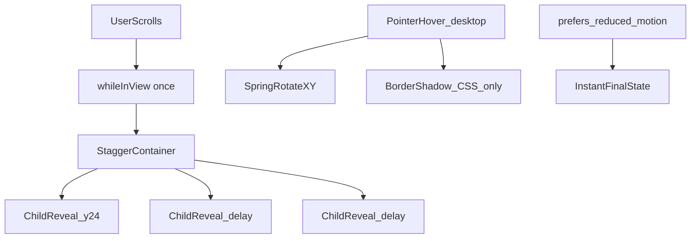
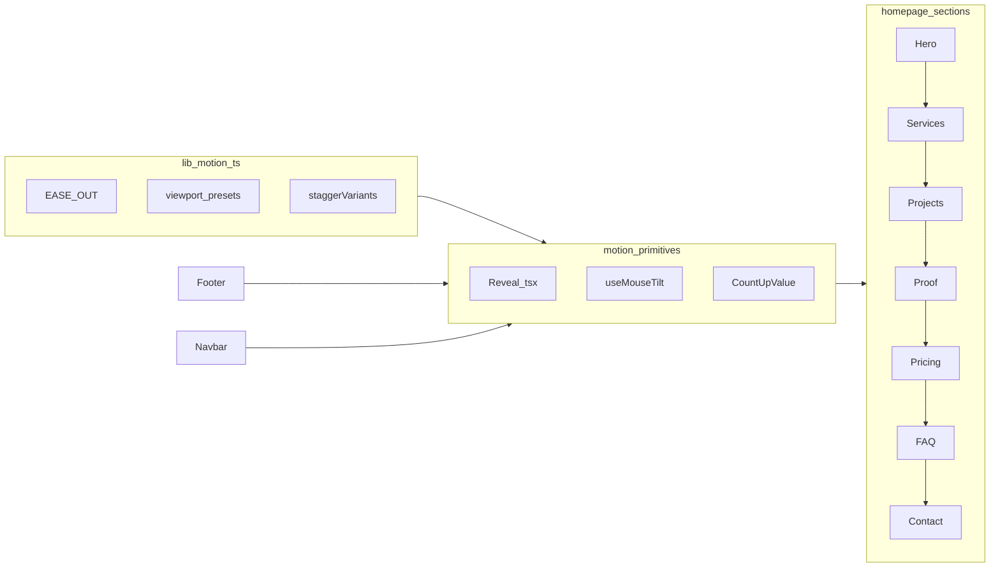

# JT Solutions — UX & Animation Plan

**Version:** 1.0  
**Scope:** Homepage (`app/page.tsx`) and shared UI chrome  
**Status:** Design specification only — no implementation in this document  

---

## Critical rule: motion only

This plan defines **premium motion, transitions, and micro-interactions** only. The following must **not** change during implementation:

| Preserve | Examples in codebase |
|----------|----------------------|
| Brand colors | `#F9FAFB` section backgrounds, CTA `linear-gradient(90deg, #10b3e7, #7c3aed)`, accents `#4f46e5`, `#2563eb`, `#10b3e7`, `#7c3aed` |
| Typography | `Heebo` (`app/layout.tsx`), `.premium-title`, `.display-title`, `.premium-subtitle`, `.gradient-text` |
| Sizing & spacing | `--radius` (14px), `--radius-soft` (8px), `--space-section-y`, section `py-16 md:py-24 lg:py-32` |
| Hebrew content | All headings, body copy, CTAs, FAQ items — zero copy edits |
| Static layout | Grid columns, card structure, RTL (`dir="rtl"`), section order |

**Allowed:** Framer Motion transforms (`opacity`, `x`, `y`, `scale`, `rotateX`, `rotateY`), spring physics, `filter: blur()` during enter only, and existing Tailwind `transition-*` where motion is disabled.

---

## 1. Executive summary

### Goal

Increase scroll depth and perceived quality so visitors **keep scrolling** through the full homepage story — from Hero through Contact — without a visual rebrand.

### Motion philosophy: calm confidence

- **Scroll reveals:** ease-out curves, moderate distance (20–24px), `once: true` — never replay on scroll-back.
- **Interaction:** short springs for hover/tap; no bouncy overshoot on large blocks.
- **RTL safety:** prefer vertical motion; avoid horizontal slides that fight Hebrew reading direction except intentional Contact column offsets.
- **Performance:** animate `transform` and `opacity` first; respect `prefers-reduced-motion`.

### Homepage scroll sequence

```
#hero → #services → #projects → #proof → #pricing → #tech-stack → #faq → #contact
```

Defined in [`app/page.tsx`](../app/page.tsx) with [`SectionDivider`](../components/ui/SectionDivider.tsx) between sections.

### Dependencies

| Package | Status |
|---------|--------|
| `framer-motion@^12.38.0` | Already in [`package.json`](../package.json) — **no install required** |

---

## 2. Current-state audit (baseline)

Audit of motion **as implemented today**. Gaps drive the recommendations in Sections 3–6.

### 2.1 Global infrastructure

| File | What exists | Gap |
|------|-------------|-----|
| [`lib/motion.ts`](../lib/motion.ts) | `EASE` `[0.22, 1, 0.36, 1]`; `viewport` presets; `staggerVariants`; `motionTransition` | No named spring tokens; no tilt/materialize variants |
| [`app/globals.css`](../app/globals.css) | `.hover-lift`; `@media (prefers-reduced-motion: reduce)` forces `0.01ms` on all transitions | No motion design tokens in CSS; mobile disables `.hover-lift` transform |
| [`components/motion/Reveal.tsx`](../components/motion/Reveal.tsx) | `whileInView` fade-up; `ready` gate avoids hydration mismatch; `useReducedMotion` → static HTML | Not used on FAQ header, Footer, Proof section header |
| [`components/motion/PageEnter.tsx`](../components/motion/PageEnter.tsx) | Page-level enter wrapper | Secondary routes only |
| [`components/layout/ScrollProgress.tsx`](../components/layout/ScrollProgress.tsx) | `useScroll` + spring `scaleX` bar (stiffness 120, damping 22) | Reference pattern for scroll-linked motion |

### 2.2 Section-by-section

| Section | ID | Primary files | Motion today | Gap |
|---------|-----|---------------|--------------|-----|
| **Hero** | `#hero` | [`Hero.tsx`](../components/sections/Hero.tsx) | `staggerVariants` + `whileInView` (`sectionLoose`); static blurred blobs | No blob parallax; trust chips appear with text (no extra stagger) |
| **Services** | `#services` | [`Services.tsx`](../components/sections/Services.tsx) | `Reveal` headers; timeline `staggerVariants`; dropdown `height: auto` (0.28s / 0.12s reduced) | Phase cards: CSS `hover:-translate-y-1` only; no timeline draw-in |
| **Projects** | `#projects` | [`Projects.tsx`](../components/sections/Projects.tsx) | `Reveal` title + masked hero `Image` | No image scale/parallax on scroll |
| **Proof** | `#proof` | [`Proof.tsx`](../components/sections/Proof.tsx), [`ProofContent.tsx`](../components/sections/ProofContent.tsx) | `dynamic(ssr:false)`; `CountUpValue` + `useInView` (amount 0.35); `Reveal` on lead panel; CSS card hover; animated pillar SVGs | Header/pillar/stat cards not staggered; no 3D tilt; count-up 1200ms (undocumented token) |
| **Pricing** | `#pricing` | [`Pricing.tsx`](../components/sections/Pricing.tsx) | `Reveal` + tier `staggerVariants` (`sectionLoose`) | Popular tier static border; retainer row no entrance |
| **Tech stack** | `#tech-stack` | Inside `Pricing.tsx` | `Reveal` on sub-header | Retainer cards static |
| **FAQ** | `#faq` | [`HomeFaq.tsx`](../components/sections/HomeFaq.tsx), [`HomeFaqAccordion.tsx`](../components/sections/HomeFaqAccordion.tsx) | Accordion `height` + opacity 0.28s `[0.22, 1, 0.36, 1]`; chevron CSS rotate | **No** section header `Reveal`; differs from [`FaqAccordion.tsx`](../components/ui/FaqAccordion.tsx) (0.22s `easeInOut`) |
| **Contact** | `#contact` | [`Contact.tsx`](../components/sections/Contact.tsx) | `Reveal` columns (`y` only) | No RTL column slide; form focus CSS only |
| **Footer** | — | [`Footer.tsx`](../components/layout/Footer.tsx) | Link `transition-colors duration-200` | No batch reveal; social icons static |
| **Navbar** | — | [`Navbar.tsx`](../components/layout/Navbar.tsx), [`NavbarMenu.tsx`](../components/layout/NavbarMenu.tsx) | Header enter `y: -80`, 0.7s; mobile `AnimatePresence`; active `motion.span` | Nav link hover minimal; phone icon CSS only |
| **CTA** | — | [`CtaButton.tsx`](../components/ui/CtaButton.tsx) | `whileHover` scale 1.05/1.02; `whileTap` 0.98; 0.1s linear | No spring; no magnetic pull |
| **Divider** | — | [`SectionDivider.tsx`](../components/ui/SectionDivider.tsx) | Static `.section-divider-line` | No scroll-triggered animation |

### 2.3 Existing numeric values (reference for implementers)

```ts
// lib/motion.ts
EASE = [0.22, 1, 0.36, 1]
staggerVariants: staggerChildren 0.1, item hidden y: 20 → show y: 0, duration 0.6

// Reveal.tsx defaults
y = 20, duration = 0.6, viewportKey = "section"

// viewport presets (all once: true)
section:       margin "-80px"
sectionLoose:  margin "-50px"
sectionTight:  margin "-60px"
sectionProof:  margin "-90px"
sectionPillar: margin "-70px"

// CtaButton.tsx
whileHover duration 0.1 easeOut
primary scale 1.05, secondary 1.02, tap 0.98

// HomeFaqAccordion.tsx
accordion: duration 0.28, ease [0.22, 1, 0.36, 1]

// FaqAccordion.tsx (service/blog pages)
accordion: duration 0.22, ease "easeInOut"

// Services dropdown
duration 0.28 (0.12 if reduced)

// ProofContent CountUpValue
duration 1200ms, ease cubic (1 - (1-t)³)

// ScrollProgress
spring stiffness 120, damping 22, mass 0.35

// Navbar header
initial y: -80, duration 0.7, ease EASE
```

---

## 3. Global motion system

Centralize new tokens in [`lib/motion.ts`](../lib/motion.ts) during implementation. Components should import tokens instead of duplicating numbers.

### 3.1 Easing curves

| Token | Value | Use |
|-------|-------|-----|
| `EASE_OUT` | `[0.22, 1, 0.36, 1]` | Alias existing `EASE` — scroll reveals, accordions, page enter |
| `EASE_IN_OUT` | `[0.4, 0, 0.2, 1]` | Section dividers, ambient loops |

### 3.2 Spring presets

| Token | Config | Use |
|-------|--------|-----|
| `SPRING_SNAPPY` | `stiffness: 400, damping: 30` | Button tap, chevron flip |
| `SPRING_SMOOTH` | `stiffness: 180, damping: 24` | Card tilt return, align with ScrollProgress feel |
| `SPRING_GENTLE` | `stiffness: 120, damping: 20` | Materialize unfold (Proof cards) |

### 3.3 Durations

| Token | Range | Use |
|-------|-------|-----|
| `DURATION_FAST` | `0.12–0.18s` | Tap feedback, focus micro-scale |
| `DURATION_UI` | `0.22–0.28s` | Accordion height, dropdown panels |
| `DURATION_REVEAL` | `0.55–0.65s` | Section headers, single blocks |

### 3.4 Stagger & distance

| Token | Value | Use |
|-------|-------|-----|
| `STAGGER_TIGHT` | `0.08s` | Hero trust chips, FAQ items |
| `STAGGER_SECTION` | `0.10–0.12s` | Phase cards, pricing tiers, Proof grid |
| `DELAY_CHILDREN` | `0.12s` | First child delay after container in view |
| `DISTANCE_REVEAL_Y` | `20–24px` | Default `Reveal` / stagger item |
| `DISTANCE_REVEAL_Y_HERO` | `28–32px` | Hero headline stack only |

### 3.5 3D tilt (desktop only)

| Token | Value | Use |
|-------|-------|-----|
| `TILT_MAX_DESKTOP` | `8–10°` | `rotateX` / `rotateY` cap |
| `TILT_MAX_MOBILE` | `0°` | Disabled — use tap scale instead |
| `TILT_PERSPECTIVE` | `1200–1400px` | Parent grid / section |
| `TILT_Z_LIFT` | `20–28px` | Inner wrapper `translateZ` to reduce text distortion |

Implement via shared hook: `hooks/useMouseTilt.ts` (spec only until built).

### 3.6 Viewport presets — when to use

| Preset | Margin | Use |
|--------|--------|-----|
| `sectionLoose` | `-50px` | Hero, Services, Pricing — large blocks |
| `section` | `-80px` | Projects, Contact header, Footer |
| `sectionTight` | `-60px` | Proof lead panel, nested articles |
| `sectionProof` | `-90px` | Dense Proof stat/pillar grid |
| `sectionPillar` | `-70px` | Optional per-card if split from grid |
| `inView` | none | Full-height columns (Contact form) |

**Rule:** Always `once: true` so animations do not re-fire when scrolling up.

### 3.7 Reduced motion contract

1. **`useReducedMotion()`** from Framer Motion in every animated client component.
2. When `true`: `duration: 0.01`, `delay: 0`, no `rotateX/Y`, no parallax, no magnetic offset.
3. **`Reveal.tsx`:** render static HTML (existing `ready` + `reduce` pattern).
4. **`globals.css`:** global `@media (prefers-reduced-motion: reduce)` — keep as safety net; do not rely on it alone (JS path gives correct initial state).



### 3.8 Motion architecture



---

## 4. Scroll animations (section specifications)

### 4.1 Hero (`#hero`)

**Files:** [`components/sections/Hero.tsx`](../components/sections/Hero.tsx)

**Preserve:** `min-h-[100svh]`, gradient `#F9FAFB → #F3F6FF`, blob colors, `display-title` + gradient span, CTA labels, trust chip styles.

| Element | Animation | Parameters |
|---------|-----------|------------|
| Content stack | Keep `staggerVariants` | `viewport: sectionLoose`, `STAGGER_SECTION` between h1 → h2 → CTAs → trust → footnote |
| H1 / H2 | `heroItemUp` | `DISTANCE_REVEAL_Y_HERO` (28–32px), `DURATION_REVEAL` |
| Trust chips | **Add** child stagger | After CTAs: `opacity 0→1`, `y: 12`, `STAGGER_TIGHT` per chip |
| Background blobs | **Add** optional parallax | `useScroll` on `#hero`; blobs `translateY` 0% → 8% of section height; **desktop only**; disable if `reduce` |
| Horizontal motion | **Forbidden** | RTL readability |

### 4.2 Services (`#services`)

**Files:** [`components/sections/Services.tsx`](../components/sections/Services.tsx)

**Preserve:** Phase card gradients (`PHASE_THEMES`), three-column grid, dropdown colors, Hebrew phase titles.

| Element | Animation | Parameters |
|---------|-----------|------------|
| Section header | Keep `Reveal` | `y: 24`, `sectionLoose`, `0.6s` |
| Timeline connector | **Add** draw-in | Desktop `lg:` only: line `scaleX: 0→1`, `transformOrigin: center`, `DURATION_REVEAL`, triggered with phase grid |
| Phase cards | Keep stagger | `timelineStagger` / `phaseItem`; **upgrade hover** to `motion` `y: -4` + existing `shadow-premium` (replace CSS `-translate-y-1`) |
| Phase card tilt | **Add** desktop | `useMouseTilt`, `TILT_MAX_DESKTOP` 8° |
| Service dropdown | Standardize | `height: auto`, `DURATION_UI` 0.28s, `EASE_OUT`; panel content `opacity: 0.6→1` over 0.2s after height starts |
| Bottom CTA block | Keep `Reveal` | `y: 20` |

### 4.3 Projects (`#projects`)

**Files:** [`components/sections/Projects.tsx`](../components/sections/Projects.tsx)

**Preserve:** Full-bleed mask on hero image, `projects-hero.png`, title copy.

| Element | Animation | Parameters |
|---------|-----------|------------|
| Title block | Keep `Reveal` | `y: 22`, `duration: 0.62` |
| Hero image | **Add** enter | `scale: 0.96→1`, `y: 18`, `opacity: 0.85→1`, `DURATION_REVEAL` |
| Hero image | **Add** optional scroll | While section centered: `scale` 1 → 1.03 max via `useScroll` + `useTransform`; clamp; disable mobile + reduced motion |
| Mask gradient | **Do not change** | Inline `maskImage` / `WebkitMaskImage` untouched |

### 4.4 Proof (`#proof`)

**Files:** [`components/sections/Proof.tsx`](../components/sections/Proof.tsx), [`components/sections/ProofContent.tsx`](../components/sections/ProofContent.tsx)

**Preserve:** Content hierarchy — **header → lead panel → 3 pillars → 3 stats**; all Hebrew strings; stat gradient numbers (`#10b3e7 → #4f46e5 → #7c3aed`); video `preload="none"`.

| Element | Animation | Parameters |
|---------|-----------|------------|
| Load strategy | Keep `dynamic(ssr:false)` | Avoids hydration mismatch when tilt/stagger run client-only |
| Section header | **Add** `Reveal` | `y: 22`, `section` |
| Lead panel | Keep or upgrade `Reveal` | **Materialize option:** `scale: 0.94→1`, `rotateX: 12°→0`, `blur: 6px→0`, `SPRING_GENTLE` — same border/background inline styles |
| Pillar cards (×3) | **Add** stagger | Container `STAGGER_SECTION`; per card fade-up `y: 20` or materialize with alternating `rotateX` / `rotateY` by index mod 3 |
| Stat cards (×3) | **Add** stagger | Same container; after pillars in DOM order for mobile |
| Stat numbers | Keep/enhance count-up | `useInView` on stats grid, `amount: 0.35`, `once: true`, duration **1.2–1.4s**, ease-out cubic; run once (`hasRunRef`) |
| Stat numbers | Visual | Keep `.bg-clip-text` gradient; optional `motion.span` scale `0.94→1` when counting starts |
| Pillar SVG icons | Keep | Existing `motion.path` loops — do not intensify |
| Lead video | Keep | Play when `leadVideoInView` 0.5; pause off-screen |
| Card hover | **Add** tilt desktop | `useMouseTilt` on each `article`; mobile: `whileTap` `scale: 0.99` only |

### 4.5 Pricing (`#pricing`) & tech stack (`#tech-stack`)

**Files:** [`components/sections/Pricing.tsx`](../components/sections/Pricing.tsx)

**Preserve:** Tier gradients, popular badge gradient, retainer accent colors, `#tech-stack` anchor.

| Element | Animation | Parameters |
|---------|-----------|------------|
| Main header | Keep `Reveal` | `y: 20`, `sectionLoose` |
| Tier cards | Keep stagger | `tiersStagger` / `tierItem`; add tilt on desktop non-popular cards |
| Popular tier | **Add** ambient pulse | `box-shadow` opacity loop 3s, indigo/violet existing rgba only; **pause on hover** |
| Tech-stack header | Keep `Reveal` | Inside `#tech-stack` block |
| Retainer cards (×3) | **Add** stagger | `opacity` + `scale: 0.9→1`, `STAGGER_TIGHT`, `sectionLoose` viewport |

### 4.6 FAQ (`#faq`)

**Files:** [`components/sections/HomeFaq.tsx`](../components/sections/HomeFaq.tsx), [`components/sections/HomeFaqAccordion.tsx`](../components/sections/HomeFaqAccordion.tsx)

**Preserve:** Open-state sky gradient (`DEEP_GROWTH_CARD`), closed white card, accent bar on open.

| Element | Animation | Parameters |
|---------|-----------|------------|
| Title block | **Add** `Reveal` | `y: 20`, `duration: 0.6` |
| Accordion list | **Add** container stagger | Each item `y: 16`, `opacity: 0→1`, `STAGGER_TIGHT` |
| Panel open/close | Unify | `height: auto`, `DURATION_UI` **0.28s**, `EASE_OUT` — align [`FaqAccordion.tsx`](../components/ui/FaqAccordion.tsx) to match |
| Chevron | **Upgrade** | `SPRING_SNAPPY` rotate `0→180deg` (replace CSS-only transition) |
| Card border/shadow | Keep | Existing `transition-all duration-300` for open styles — no new colors |

### 4.7 Contact (`#contact`)

**Files:** [`components/sections/Contact.tsx`](../components/sections/Contact.tsx)

**Preserve:** Form fields, validation, success state, social link colors.

| Element | Animation | Parameters |
|---------|-----------|------------|
| Header | Keep `Reveal` | `y: 24`, `section` |
| Form column | **Add** optional slide | `Reveal` `x: 24` (from right in RTL = form side) |
| Info column | **Add** optional slide | `Reveal` `x: -24` |
| Submit success | **Add** `AnimatePresence` | Cross-fade `opacity` only; no layout shift |
| Inputs | **Add** focus micro | `scale: 1→1.01`, `DURATION_FAST`; keep `focus:ring-indigo-100` colors |

### 4.8 Footer

**Files:** [`components/layout/Footer.tsx`](../components/layout/Footer.tsx)

**Preserve:** Gradient background, link colors (`#6B7280` → hover `#10b3e7` / `#22C55E`), social brand colors.

| Element | Animation | Parameters |
|---------|-----------|------------|
| Column grid | **Add** batch reveal | `whileInView` when top hits ~85% viewport; each column `y: 16`, stagger `0.06s` |
| Text links | **Add** underline | Pseudo-element `scaleX: 0→1`, `transformOrigin: center`, 200ms |
| Social buttons | **Add** hover | `scale: 1.05`, existing inline `hoverBackground` — motion only |

### 4.9 Section dividers

**Files:** [`components/ui/SectionDivider.tsx`](../components/ui/SectionDivider.tsx)

**Preserve:** `.section-divider-line` gradient and center dot colors.

| Element | Animation | Parameters |
|---------|-----------|------------|
| Line | **Add** | `scaleX: 0.3→1`, `opacity: 0.6→1`, `DURATION_REVEAL` 0.5s, `EASE_IN_OUT` |
| Center dot | **Add** | `opacity: 0→1`, delay `0.15s` |

---

## 5. Micro-interactions catalog

### 5.1 Buttons — `CtaButton`

**File:** [`components/ui/CtaButton.tsx`](../components/ui/CtaButton.tsx)

| State | Behavior | Notes |
|-------|----------|-------|
| Hover (primary) | Spring `scale: 1.04`, `brightness(1.06)`, `--shadow-glow-active` | Replace 0.1s linear |
| Hover (secondary) | Spring `scale: 1.02`, bg `#F8FAFC` | Keep border `slate-200` |
| Tap | `scale: 0.97` | `SPRING_SNAPPY` |
| Magnetic (desktop) | Cursor within 80px → button shifts ±4px on X/Y; spring reset on leave | Optional Phase 3; disable touch |
| Focus-visible | CSS ring | `focus:ring-2 focus:ring-indigo-100` — no motion required |

### 5.2 Cards — Services, Pricing, Proof

| Interaction | Desktop | Mobile / reduced |
|-------------|---------|------------------|
| 3D tilt | `useMouseTilt`, max 8–10° | Off |
| Lift | `y: -4` via motion | Off |
| Shadow | Existing `shadow-premium` / hover rgba | `active:scale-[0.99]` |
| Border highlight | `border-color` + `box-shadow` transition 280ms | Same colors only |

**Text safety:** Apply tilt to outer `motion.article`; inner `.proof-bento-card-inner` or equivalent gets `translateZ(20px)` so glyphs do not shear.

### 5.3 Navigation

**Files:** [`Navbar.tsx`](../components/layout/Navbar.tsx), [`NavbarMenu.tsx`](../components/layout/NavbarMenu.tsx)

| Element | Behavior |
|---------|----------|
| Header enter | Keep `y: -80 → 0`, 0.7s `EASE_OUT` after `mounted` |
| Active link | Keep `motion.span` `layoutId` indicator |
| Link hover | `y: -1` + bottom border `scaleX: 0→1`, color `#4f46e5` |
| Mobile drawer | Keep `AnimatePresence`; panel `opacity` + `x` slide |
| Phone icon | Optional spring `scale: 1.08` on hover — keep gradient stroke |

### 5.4 Inline links (content, footer, blog)

- Underline slides in from center: `scaleX` 0 → 1, 200ms `EASE_OUT`.
- No color changes beyond existing hover tokens.

### 5.5 Scroll progress (reference)

**File:** [`ScrollProgress.tsx`](../components/layout/ScrollProgress.tsx)

- Top bar `scaleX` tied to `scrollYProgress` — **do not duplicate**; use as reference for `SPRING_SMOOTH` tuning.

---

## 6. Data-driven animations

| Data UI | Location | Trigger | Spec |
|---------|----------|---------|------|
| **Count-up** `50+`, `24h`, `1:1` | `ProofContent` `CountUpValue` | `useInView(statsRef, { once: true, amount: 0.35 })` | 0 → target over 1.2–1.4s; cubic ease-out; integers only; suffix static |
| **FAQ accordion** | `HomeFaqAccordion`, `FaqAccordion` | Click | `AnimatePresence` + `height: auto`; opacity panel; `DURATION_UI` |
| **Services dropdown** | `ServiceRecordDropdown` | Click; one open at a time | Same as FAQ; `Escape` closes (keep a11y) |
| **Cookie consent** | `CookieConsent.tsx` | Mount | Existing `AnimatePresence` — no change |
| **Navbar section spy** | `Navbar.tsx` | Scroll | No animation — state only |

---

## 7. Mobile & performance strategy

### 7.1 Disable on mobile (`max-width: 768px`) and `useReducedMotion`

- 3D card tilt  
- Magnetic CTA pull  
- Hero/blob parallax  
- Pointer-tracking highlight gradients  
- Projects scroll-linked scale  

### 7.2 Keep on mobile (simplified)

| Effect | Mobile adjustment |
|--------|-------------------|
| Scroll reveal | `DISTANCE_REVEAL_Y` → **12px**; same `once: true` |
| Stagger | Cap visible delay (max 3 stepped children before user scrolls past) |
| Count-up | Full animation (single RAF loop — acceptable) |
| Accordion | `height` + `opacity`; `DURATION_UI` unchanged |
| Tap feedback | `whileTap` `scale: 0.98–0.99` on buttons/cards |

### 7.3 Touch vs hover

- Never depend on `whileHover` for critical affordances.
- Use `@media (hover: hover) and (pointer: fine)` or hook `matchMedia` before enabling tilt/magnetic.

### 7.4 Performance rules

1. Prefer **`transform`** and **`opacity`** — avoid animating `width`, `height` except accordion (`height: auto` is acceptable with `overflow: hidden`).
2. **One** continuous `requestAnimationFrame` loop per page max (count-up).
3. **`will-change: transform`** — toggle class only during active hover on tilt cards.
4. **Videos:** `preload="none"`; play only in view (Proof lead video — already implemented).
5. **Springs:** limit concurrent spring-driven elements to ~6 in viewport.
6. **Proof `ssr: false`:** document in PR — prevents hydration mismatch for client-only transforms.
7. **CLS:** all `initial` states must not reserve space differently from `animate` (same layout; opacity/y only).

### 7.5 Testing matrix

| Environment | Checks |
|-------------|--------|
| iOS Safari | Scroll jank through Proof + Services; accordion smooth |
| Android Chrome mid-tier | Disable tilt; verify 60fps scroll |
| Desktop Chrome | Full tilt + stagger |
| `prefers-reduced-motion: reduce` | Static UI, instant accordion |
| Slow 3G | No extra network; motion does not block LCP (Hero text still SSR) |

---

## 8. Implementation roadmap (future PRs)

**Do not implement from this doc alone** — use phases:

### Phase 1 — Foundation
- Extend [`lib/motion.ts`](../lib/motion.ts) with tokens in Section 3.
- Add `hooks/useMouseTilt.ts`.
- Unify FAQ accordion timing across `HomeFaqAccordion` + `FaqAccordion`.
- Export `proofMaterializeVariants` / `proofBentoStagger` if Proof gets bento layout.

### Phase 2 — High-impact sections
- Proof: header `Reveal`, pillar/stat stagger, count-up polish.
- Projects: image enter + optional scroll scale.
- FAQ: header + list stagger.

### Phase 3 — Micro-interactions
- `CtaButton` springs + optional magnetic.
- Card tilt: Services phases, Pricing tiers, Proof articles.

### Phase 4 — Chrome & polish
- Footer batch reveal; `SectionDivider` animate.
- Contact column slide; nav link hover underline.
- Hero trust-chip stagger; optional blob parallax.

### Phase 5 — QA
- Acceptance checklist (Section 9).
- Lighthouse CLS + interaction audit.
- Cross-browser smoke on RTL layout.

---

## 9. Acceptance checklist

Before merging any animation PR:

- [ ] Side-by-side screenshots: colors, fonts, spacing, Hebrew copy **unchanged**
- [ ] Every `whileInView` uses `once: true` (no replay on scroll up)
- [ ] `prefers-reduced-motion`: no transforms, instant reveals, accordions still usable
- [ ] Mobile: no tilt, no parallax, no scroll jank on Proof/Services
- [ ] RTL layout: no unintended horizontal shifts on body text
- [ ] Keyboard: FAQ/Services dropdowns still operable; focus rings visible
- [ ] Proof video pauses off-screen; does not autoplay before in view
- [ ] No new npm dependencies without approval (Framer Motion sufficient)
- [ ] `npm run build` passes; no hydration warnings on homepage

---

## 10. File reference index

| Purpose | Path |
|---------|------|
| Motion tokens | `lib/motion.ts` |
| Scroll reveal primitive | `components/motion/Reveal.tsx` |
| Page wrapper | `components/motion/PageEnter.tsx` |
| Mouse tilt (to add) | `hooks/useMouseTilt.ts` |
| Bento card (optional) | `components/sections/ProofBentoCard.tsx` |
| Homepage composition | `app/page.tsx` |
| Global CSS / reduced motion | `app/globals.css` |
| Hero | `components/sections/Hero.tsx` |
| Services | `components/sections/Services.tsx` |
| Projects | `components/sections/Projects.tsx` |
| Proof loader | `components/sections/Proof.tsx` |
| Proof content | `components/sections/ProofContent.tsx` |
| Pricing + tech-stack | `components/sections/Pricing.tsx` |
| FAQ | `components/sections/HomeFaq.tsx`, `HomeFaqAccordion.tsx` |
| Contact | `components/sections/Contact.tsx` |
| Footer | `components/layout/Footer.tsx` |
| Navbar | `components/layout/Navbar.tsx`, `NavbarMenu.tsx` |
| CTA | `components/ui/CtaButton.tsx` |
| Dividers | `components/ui/SectionDivider.tsx` |
| Scroll bar | `components/layout/ScrollProgress.tsx` |
| Nav hashes | `lib/navigation.ts` |

---

*End of UX & Animation Plan — JT Solutions*
